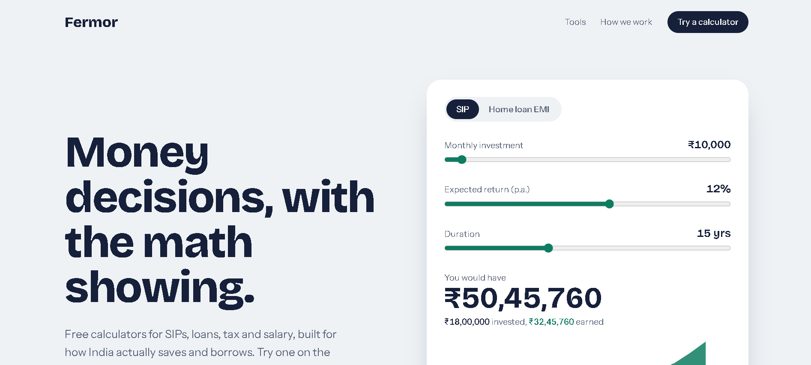

# Fermor Homepage

A homepage for Fermor, built as part of the Founding Software Engineering Intern assignment.

**Live site:** https://fermor-home-pink.vercel.app




## What I was going for

Fermor's whole pitch is "here is the math, you decide". So I did not want a homepage that only talks about clarity. I wanted the first screen to show it.

The hero has a working SIP and home loan EMI calculator. Move a slider and the result, the chart and the numbers change right away. Under every result there is a "Show the math" section with the formula, your own inputs filled in, and the assumptions behind it. That is the part I care about most, because it matches what Fermor says about itself: no black boxes.

Below the hero there is a list of tools, and a short section on how Fermor works (no product selling, no login, no paywall). The footer carries the honest disclaimer that Fermor is not a registered adviser.

## Decisions I made

- **Calculator first, not a stock illustration.** A person landing here should be able to do something useful in the first five seconds.
- **Only two calculators are real.** SIP and EMI work. FD, tax, salary and retirement are marked "Soon" instead of being faked. I would rather show less that works than more that does not.
- **Indian number format.** Amounts show as ₹12,34,567, not ₹1,234,567, because this is made for Indian users. Numbers use tabular figures so they do not jitter while sliding.
- **Colours with meaning.** Amber is the money you put in, green is what it grows into. The same two colours are used in the chart and the text.
- **Plain SVG for the chart.** The chart is simple enough that I did not want to add a charting library just for it.
- **Calculation logic is separate.** The formulas live in `lib/finance.js` as plain functions, so they are easy to read and test without touching the UI.
- **Small details.** The layout works on phones, keyboard focus is visible, and animation respects the reduced-motion setting. There is only one entrance animation on the page.

## Tech

- Next.js 15 (App Router)
- React 19
- Tailwind CSS v4
- Deployed on Vercel

## Run it locally

You need Node.js 18.18 or newer.

```bash
git clone https://github.com/<NITESH864>/fermor-home.git
cd fermor-home
npm install
npm run dev
```

Open http://localhost:3000.

To check a production build:

```bash
npm run build
npm start
```

## Project structure

```
app/
  layout.jsx        fonts and page metadata
  page.jsx          the homepage sections
  globals.css       colours and base styles
components/
  Calculator.jsx    SIP and EMI calculator (client component)
lib/
  finance.js        SIP and EMI formulas, rupee formatting
```

## What I would do with more time

- Build the FD, income tax and salary calculators.
- Add a dark mode.
- Write unit tests for `lib/finance.js`, checking the formulas against known bank examples.
- Let people share their calculator result through a link.

## A note

The calculators give estimates based on the numbers you enter. Real returns and loan terms vary, and this is not financial advice.